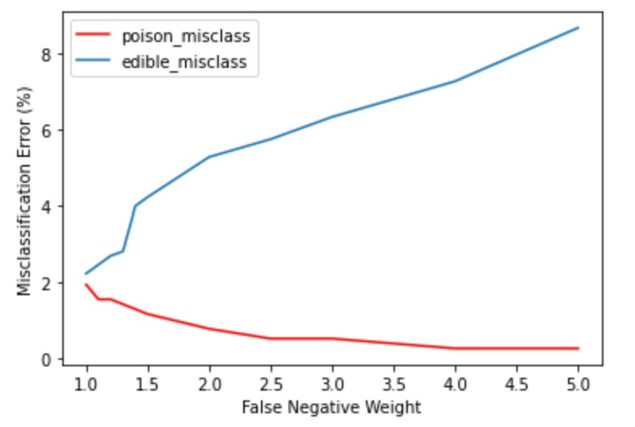

## A Cost-Sensitive Neural Network for Identifying Poisonous Mushrooms

In traditional classification problems, all possible types of misclassification errors are assumed to carry the same cost. For example, in binary classification, a false negative is presumed to be just as costly of an error as a false positive. However, this is not the case in many problem contexts. For situations in which costs differ according to the type of misclassification made, cost-sensitive models are employed. One example in which such a model would be useful is the classification of edible and poisonous mushrooms. A cost-sensitive model would be useful in this context because misclassifying a poisonous mushroom as being edible (false negative) is a much more egregious error than vice versa (false positive).

The Mushroom Dataset is obtained from the UC Irvine Machine Learning Repository. The dataset consists of 8,124 observations and 22 different mushroom features, such as cap shape, cap surface, habitat, and color. The binary class outcome variable is the edibility of the mushroom, where the classes include poisonous (1) or edible (0). 

Several others have implemented artificial neural networks and other data mining techniques such as decision trees on this mushroom data set with high success. In this project, I aim to build upon past work by building a cost-sensitive neural network to account for the varying misclassification costs. 

This is implemented in PyTorch (see file **nn_code.ipynb**) using a cost-sensitive loss function. With this code, we can observe the changes in misclassification rates by experimenting with different costs. For example, the plot below shows how the poisonous misclassification rate and edible misclassification rate change as the false negative cost increases (false positive cost is held at 1.0). 

As intended, increasing the false negative cost decreases the poisonous misclassification rate at the expense of the edible misclassification rate, which increases. 

This project allows for experimentation with cost-sensitivity in neural networks and its impact on different misclassifications to find the optimal balance.
